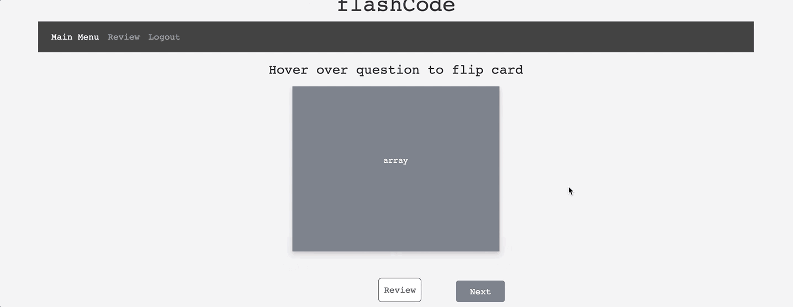

# flashCodeMaster
**Purpose of the app:** The app is created to help Users study coding using virtual flashcards. These virtual flashcards are meant to provide a more convenient alternative to the conventional pen and paper method of flashcard notes.  

**How to use:** Users have the option to register with their email or log in as a guest. Once logged in, the user has access to six decks of cards, each representing a different programming language and vocabulary. When a user selects a card deck, they are redirected to that specific deck. The card face shown presents the term and when the User hovers over the card, the corresponding definition and example is revealed. The User will also be presented with book resource options related to the programming language as well as previous, next, and review buttons. The Previous and Next buttons help the User access the next or previous cards in the deck. When clicked, the review button saves the specified card to the review tab located on the navigation bar. The User can access their saved terms on the review page where they can choose to delete specified terms when no longer needed.

**Features on the app:** The app has user authentication for both Registration and Log In options. The User review page is specific to each users saved terms. App has the ability to link directly to more resources using GoogleBooks API. When user logs back in, their saved terms are saved and available from previous sessions.

**Features:** HTML, CSS, Bootstrap, JavaScript, JQuery, FireBase, Google Books API

**URL:** http://flashcode.surge.sh/index.html

**Login Screen:**

**Example of Flash Cards:**

